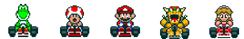

# Racing Game

In this game, two players will use the same keyboard to play against each other in a simple racing game.

Your objective is to create a game board that allows the users to press different buttons to move their selected player across the screen to the finish line.

**Bonus:** Check for a win and create a popup that alerts the users who won the game.